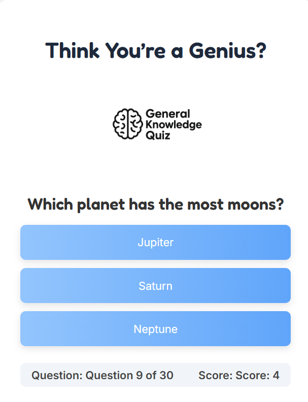
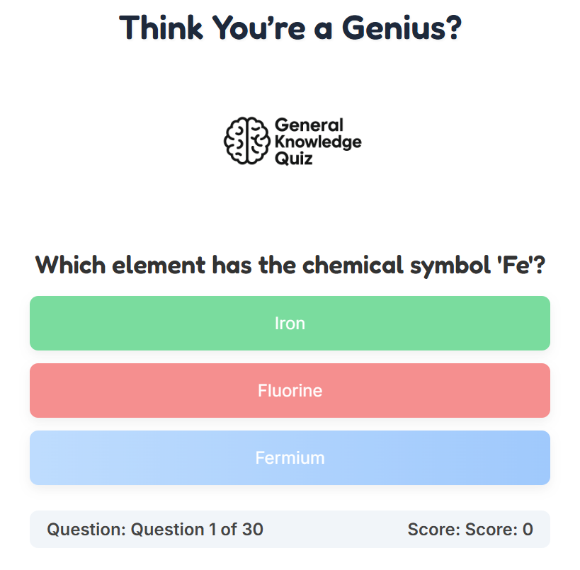
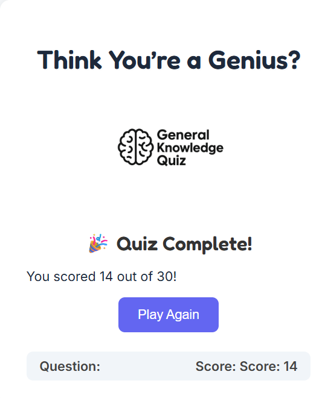

# 🧠 Think You're a Genius? – General Knowledge Quiz

An interactive web-based quiz that tests your general knowledge with multiple-choice questions. Clean design, responsive layout, and instant visual feedback to keep users engaged.

---

## 💡 Purpose & Value

The site is built for curious minds and trivia lovers of all ages. It provides value by:

- Offering a fun and accessible brain-training experience  
- Presenting multiple choice questions across a wide range of topics  
- Giving immediate feedback on whether the selected answer is correct or incorrect  
- Automatically progressing to the next question without extra clicks  
- Tracking and displaying the user's score throughout the quiz  
- Showing which question the user is currently on  
- Delivering a final score summary and end-of-quiz feedback  
- Being fully responsive and accessible across all devices  
- (Coming soon) Including a progress bar to visually track completion

## 🌐 Deployment Instructions

- **Live Website:** _TBC_
- **GitHub Repository:** _TBC_

### 🔧 Running the site locally:
1. Clone the repository or download it as a ZIP.
2. Extract the files if downloaded.
3. Open `index.html` in your browser.
4. No build tools or installations required — it's a static HTML/CSS/JS project.

---

## 🧩 User Stories

### 🧑‍🎓 User Story: Question & Answer Flow

**As a user**, I want to be shown one question at a time with clear answer options, similar to familiar quiz show formats.

**Acceptance Criteria:**
- Only one question displays at a time.
- Answer choices are easy to click and readable.

**Tasks:**
- Create a data array of question objects.
- Use JavaScript to update the DOM with each question.
- Add event listeners to buttons for answer selection.

---

### 🧠 User Story: Score Tracking

**As a user**, I want to see how many questions I've answered correctly, so I can monitor my progress and aim to beat my own score.

**Acceptance Criteria:**
- A score is displayed and updates after each question.
- The final score is shown at the end of the quiz.

**Tasks:**
- Use a variable to track score.
- Update score in real-time and display it in the UI.
- Show a message at the end with total points earned.

---

### 🎨 User Story: Visual Feedback & Engagement

**As a user**, I want to receive instant feedback when I answer a question, so I know if I was correct and stay engaged.

**Acceptance Criteria:**
- Correct/incorrect answers are colour-coded.

**Tasks:**
- Use JavaScript to compare selected answer to correct answer.
- Apply CSS class for feedback (e.g., green/red highlight).

---

## 🖼️ Wireframes _(WIP)_

---

## 🗂️ Site Structure _(WIP)_

The site will consist of a single main page with:

### 🏠 **Quiz Interface** (`index.html`)
- Welcome/start screen
- Question & answer section
- Live score display
- End-of-quiz summary

---

## 🔗 External Resources _(WIP)_
- Sound effects (e.g., [Zapsplat](https://www.zapsplat.com))
- Google Fonts or icons
- JavaScript references

---

## ✅ Testing _(WIP)_

Testing will be conducted across multiple devices and browsers to verify:

- Question and answer functionality
- Score calculation and display
- Colour-coded feedback
- Button interactions
- Layout responsiveness
- Accessibility for keyboard users

---

## 📱 Responsiveness _(WIP)_

Responsiveness will be tested using:

- Chrome DevTools (mobile/tablet/desktop modes)
- Manual testing on phone and tablet
- Relative units (%, rem) and media queries

---
## 📸 Screenshots

### ❓ Question in Progress

### ✅ Correct Answer Feedback

### ❌ Incorrect Answer Feedback

### 🎯 Final Score Screen

---

## 🧪 Automated Testing _(WIP)_

<!-- Placeholder – if using Lighthouse or other tools -->

---

## 🧪 W3C Validation

### HTML Validation _(WIP)_

### CSS Validation _(WIP)_

---

## 📋 Test Summary Documentation _(WIP)_

| Feature                          | Tested Device/Browser       | Status      |
|----------------------------------|-----------------------------|-------------|
| Quiz loads & starts              |                             |             |
| Questions update dynamically     |                             |             |
| Score tracks correctly           |                             |             |
| Correct/incorrect feedback       |                             |             |
| End screen displays total score  |                             |             |
| Colour feedback is visible       |                             |             |
| Responsive on all screen sizes   |                             |             |
| HTML5 validity (W3C)             |                             |             |
| CSS3 validity (W3C)              |                             |             |

---
