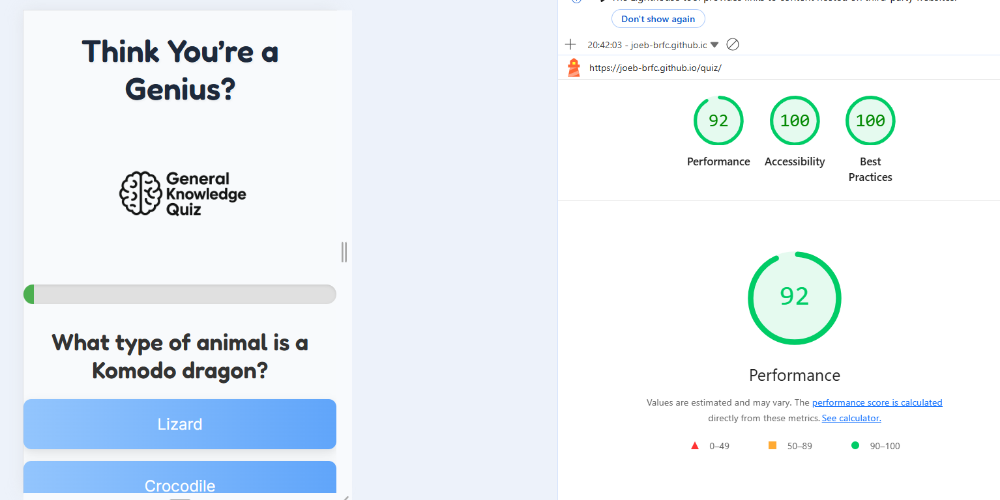
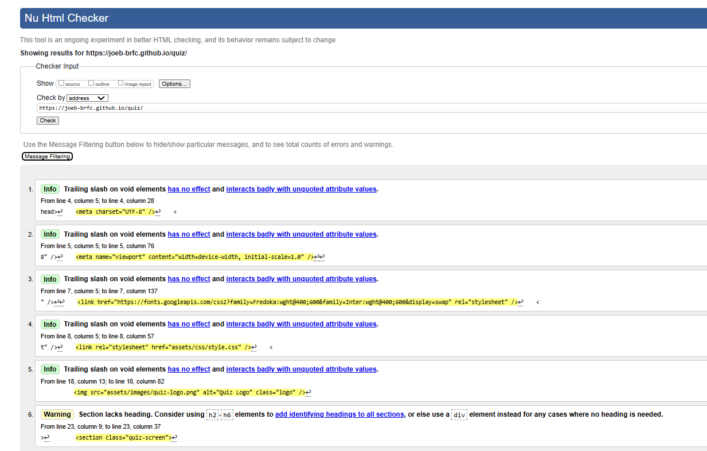
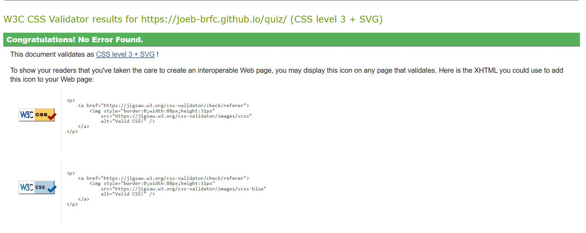
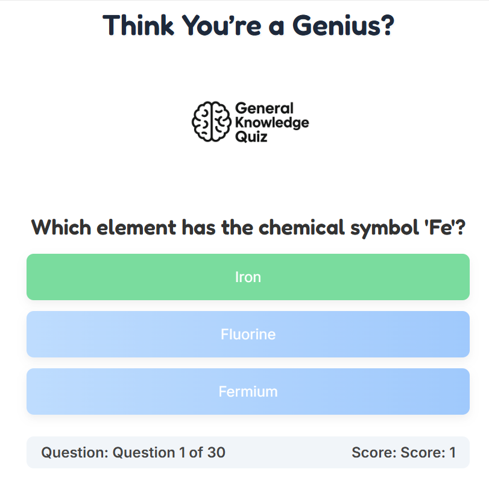

# 🧠 Think You're a Genius? – General Knowledge Quiz

An interactive web-based quiz that tests your general knowledge with multiple-choice questions. Clean design, responsive layout, and instant visual feedback to keep users engaged.

---

## 💡 Purpose & Value

The site is built for curious minds and trivia lovers of all ages. It provides value by:

- Offering a fun and accessible brain-training experience  
- Presenting multiple choice questions across a wide range of topics  
- Giving immediate feedback on whether the selected answer is correct or incorrect  
- Automatically progressing to the next question without extra clicks  
- Randomising the question order for varied replayability  
- Tracking and displaying the user's score throughout the quiz  
- Showing which question the user is currently on  
- Providing a dynamic visual progress bar that updates in real time  
- Delivering a final score summary and end-of-quiz feedback  
- Being fully responsive and accessible across all devices

## 🌐 Deployment Instructions

- **Live Website:** _TBC_
- **GitHub Repository:** _TBC_

### 🔧 Running the site locally:
1. Clone the repository or download it as a ZIP.
2. Extract the files if downloaded.
3. Open `index.html` in your browser.
4. No build tools or installations required — it's a static HTML/CSS/JS project.

---

## 🧩 User Stories

---

### 🧑‍🎓 User Story: Question & Answer Flow

**As a user**, I want to be shown one question at a time with clear answer options, so I can focus without distractions.

**Acceptance Criteria:**
- Only one question is visible at a time.
- Questions appear in a different order each time.
- Answer options are clearly labelled and easy to click.

**Tasks:**
- Create an array of question objects.
- Randomise the array using a shuffle function.
- Display each question and answer set via DOM manipulation.
- Add event listeners to handle answer selection.

---

### 📊 User Story: Progress Feedback

**As a user**, I want to see how far through the quiz I am, so I feel a sense of progression.

**Acceptance Criteria:**
- A visual progress bar updates with each question.
- A label shows the current question number out of total.

**Tasks:**
- Add a styled progress bar element to the HTML.
- Create a function to calculate and update progress.
- Update the visual and numeric display dynamically with each new question.

---

### 🧠 User Story: Real-Time Score Tracking

**As a user**, I want to see how many answers I’ve got right, so I can monitor my performance.

**Acceptance Criteria:**
- The score is displayed and updates after each question.
- The final score is shown clearly at the end.

**Tasks:**
- Use a variable to track score.
- Increment the score on correct answers.
- Display the score in a designated section of the page.
- Show the final score summary on the end screen.

---

### 🎨 User Story: Visual Answer Feedback

**As a user**, I want to get immediate feedback after I answer, so I know if I was right or wrong.

**Acceptance Criteria:**
- Correct answers are highlighted green, incorrect answers red.
- All buttons are disabled after selection.
- Correct answer is always shown, even if the user chose wrong.

**Tasks:**
- Use a dataset to store the correct answer.
- Apply CSS classes for visual feedback.
- Disable all answer buttons after a selection is made.
- Add a delay before showing the next question.

---

### 🔁 User Story: Replayability

**As a user**, I want to restart the quiz when I’m finished, so I can try again and improve my score.

**Acceptance Criteria:**
- A “Play Again” button appears on the final screen.
- The score, progress, and question index reset when restarting.
- A fresh set of shuffled questions is shown.

**Tasks:**
- Create a restart function that resets state variables.
- Attach an event listener to the restart button.
- Call the shuffle function again on restart.
- Reload the first question and update the score/progress displays.

💬 All acceptance criteria and tasks listed in the user stories have been fully implemented and verified during development.

## 🖼️ Wireframes _(WIP)_

---

## 🗂️ Site Structure _(WIP)_

The site will consist of a single main page with:

### 🏠 **Quiz Interface** (`index.html`)
- Welcome/start screen
- Question & answer section
- Live score display
- End-of-quiz summary

---

## 🔗 External Resources _(WIP)_
- Sound effects (e.g., [Zapsplat](https://www.zapsplat.com))
- Google Fonts or icons
- JavaScript references

---

## ✅ Testing

Manual and automated testing were used to ensure the quiz works correctly across devices, browsers, and screen sizes.

---

### 📱 Manual Testing

The quiz was manually tested on the following:

- **Browsers:** Chrome, Edge, Firefox
- **Devices:** Desktop, tablet, mobile (using Chrome DevTools and real devices)
- **Functional tests performed:**
  - Quiz loads correctly
  - Questions are shuffled each time
  - Only one question is shown at a time
  - Score updates correctly after each answer
  - Correct/incorrect feedback appears (green/red)
  - Progress bar updates in real-time
  - Final score screen is shown at the end
  - "Play Again" button resets the quiz fully
  - Keyboard accessibility works for navigation and selection
  - Layout remains fully responsive on all screen sizes

All features worked as intended, with no bugs or performance issues detected during testing.

---

### 🧪 Lighthouse Audit (Mobile)

A Lighthouse audit was run using Chrome DevTools in **mobile** view. The quiz scored highly in all categories:

- **Performance:** 92  
- **Accessibility:** 100  
- **Best Practices:** 100

---

### ✅ HTML Validation – W3C

The site’s HTML was tested using the [W3C HTML Validator](https://validator.w3.org).

- No major errors were found
- Minor info messages were related to void element slashes (optional)
- One warning suggested adding a heading to a section, which does not affect functionality

---

### 🎨 CSS Validation – W3C

The site’s CSS was tested using the [W3C CSS Validator](https://jigsaw.w3.org/css-validator).

- No errors or warnings were found
- The document was confirmed to be valid CSS level 3 + SVG

---

## 📱 Responsiveness _(WIP)_

Responsiveness will be tested using:

- Chrome DevTools (mobile/tablet/desktop modes)
- Manual testing on phone and tablet
- Relative units (%, rem) and media queries

---
## 📸 Screenshots

### ❓ Question in Progress

### ✅ Correct Answer Feedback

### ❌ Incorrect Answer Feedback

### 🎯 Final Score Screen

---

## 🧪 Automated Testing _(WIP)_

<!-- Placeholder – if using Lighthouse or other tools -->

---

## 🙌 Acknowledgements

- Question randomisation implemented using the [Fisher-Yates Shuffle](https://stackoverflow.com/a/2450976), credited to Laurens Holst via Stack Overflow.
- Progress bar functionality adapted from [MDN Web Docs – style manipulation](https://developer.mozilla.org/en-US/docs/Web/API/HTMLElement/style).
- Fonts provided via [Google Fonts](https://fonts.google.com/)

---

## 📋 Test Summary Documentation

| Feature                          | Tested Device/Browser       | Status      |
|----------------------------------|-----------------------------|-------------|
| Quiz loads & starts              | Chrome, Edge, Firefox       | ✅ Pass      |
| Questions update dynamically     | All                         | ✅ Pass      |
| Score tracks correctly           | All                         | ✅ Pass      |
| Correct/incorrect feedback       | All                         | ✅ Pass      |
| End screen displays total score  | All                         | ✅ Pass      |
| "Play Again" restarts quiz       | All                         | ✅ Pass      |
| Colour feedback is visible       | All                         | ✅ Pass      |
| Responsive on all screen sizes   | Desktop, Tablet, Mobile     | ✅ Pass      |
| HTML5 validity (W3C)             | validator.w3.org            | ✅ Pass      |
| CSS3 validity (W3C)              | jigsaw.w3.org               | ✅ Pass      |
| Lighthouse Performance           | Chrome DevTools (mobile)    | ✅ 92 Score  |
| Lighthouse Accessibility         | Chrome DevTools (mobile)    | ✅ 100 Score |
| Lighthouse Best Practices        | Chrome DevTools (mobile)    | ✅ 100 Score |

---
